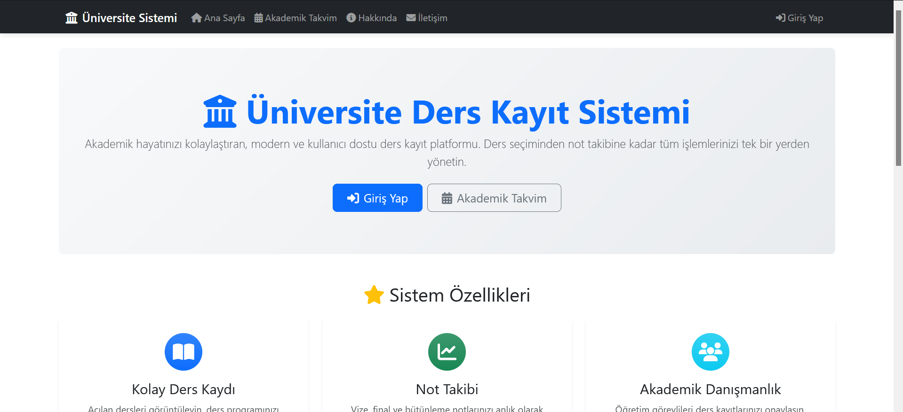
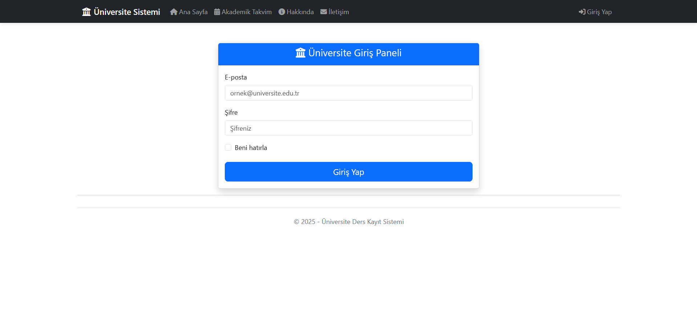
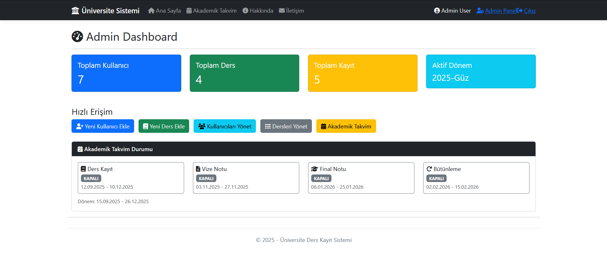
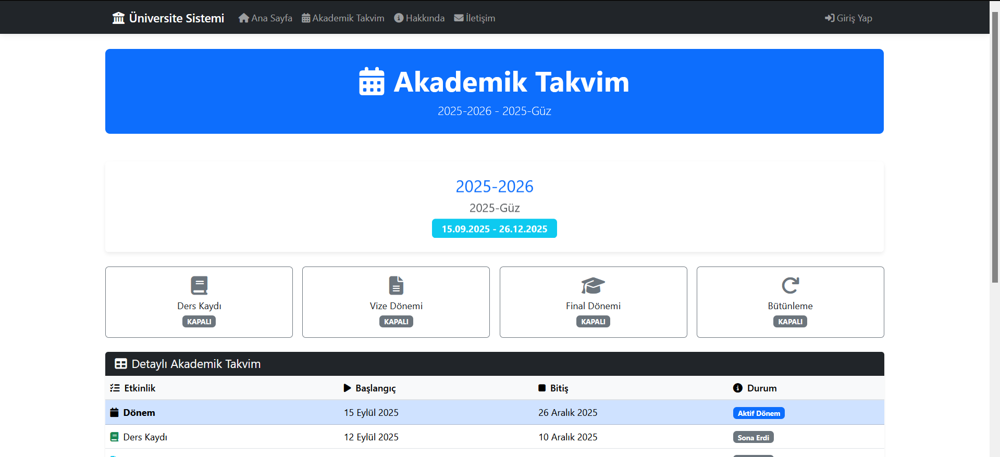
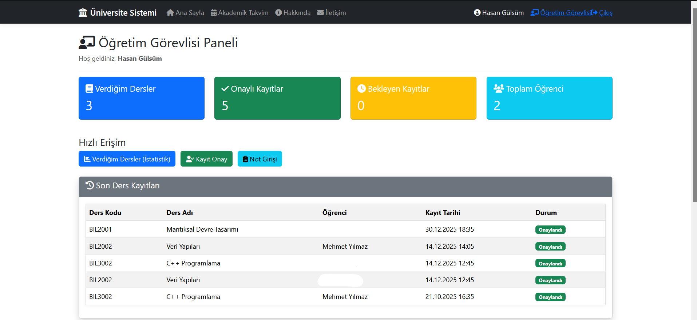
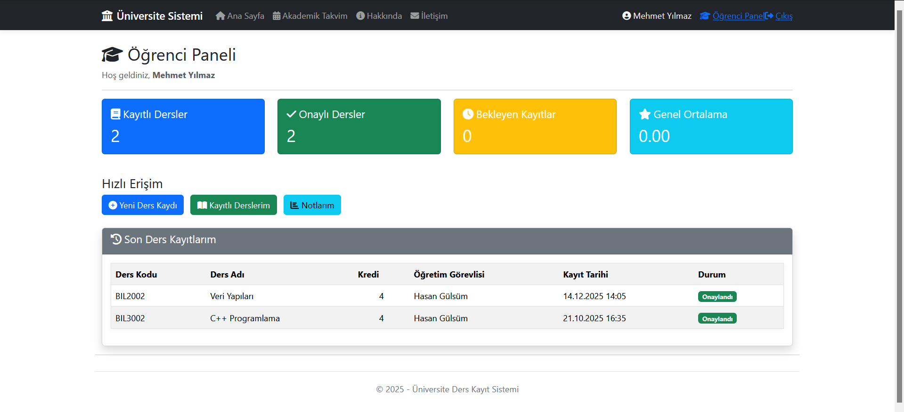
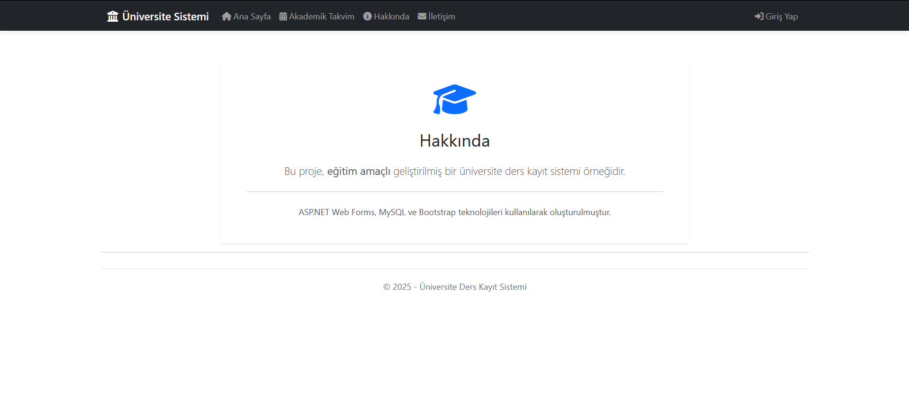
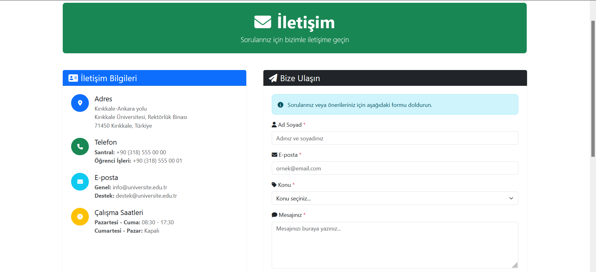

# Universite Ders Kayit ve Akademik Takip Sistemi

<p align="center">
  
  
  
  
  
  
  
  
</p>

<p align="center">
  <strong>Rol tabanli (Admin / Ogretim Gorevlisi / Ogrenci) yetkilendirme ile kullanici, ders ve kayit yonetimi yapan kapsamli bir ASP.NET Web Forms uygulamasi.</strong>
</p>

---

## Icindekiler

- [Ozellikler](#ozellikler)
- [Teknoloji Yigini](#teknoloji-yigini)
- [Proje Yapisi](#proje-yapisi)
- [Kurulum](#kurulum)
- [Veritabani Semasi](#veritabani-semasi)
- [Kullanim](#kullanim)
- [Ekran Goruntuleri](#ekran-goruntuleri)
- [Gelistirme Notlari](#gelistirme-notlari)
- [Katki](#katki)
- [Lisans](#lisans)

---

## Ozellikler

### Kimlik Dogrulama ve Yetkilendirme
- Oturum (Session) tabanli kimlik dogrulama
- E-posta veya kullanici numarasi ile giris
- Rol bazli sayfa erisim kontrolu
- Otomatik yonlendirme (rol bazli dashboard)

### Kullanici Rolleri

| Rol | Yetkiler |
|-----|----------|
| **Admin** | Tam sistem yonetimi, kullanici ve ders CRUD islemleri |
| **Ogretim Gorevlisi (Hoca)** | Ders kayit onayi, not girisi, ders istatistikleri |
| **Ogrenci** | Ders kaydi, kayitli dersleri goruntuleme, not takibi |

### Admin Paneli
- **Kullanici Yonetimi**
  - Kullanici listeleme, arama ve filtreleme
  - Yeni kullanici ekleme (otomatik kullanici numarasi uretimi)
  - Kullanici duzenleme ve silme
  - Aktif/Pasif durum yonetimi
- **Ders Yonetimi**
  - Ders listeleme, arama ve filtreleme
  - Yeni ders ekleme
  - Ders duzenleme ve silme
  - Ogretim gorevlisi atama
- **Akademik Takvim**
  - Akademik donem kaynakli tarih araliklarini merkezi olarak yonetme
  - Aktif donem tanimlama (tek aktif kayit)
  - Admin dashboard uzerinden surec durumlarini (ders kayit / not girisi) gosterme
- **Dashboard**
  - Toplam kullanici, ders ve kayit istatistikleri
  - Rol bazli kullanici dagilimi

### Ogretim Gorevlisi Paneli
- **Ders Istatistikleri**
  - Verilen derslerin listesi
  - Kayitli ogrenci sayilari
  - Kontenjan durumu
- **Kayit Onay**
  - Bekleyen ders kayitlarini goruntuleme
  - Kayit onaylama/reddetme
- **Not Girisi**
  - Vize, Final, Butunleme not girisi
  - Ogrenci bazli not guncelleme

### Ogrenci Paneli
- **Ders Kaydi**
  - Acik dersleri goruntuleme
  - Kontenjan kontrolu ile ders kaydi
  - Kayit durumu takibi (Beklemede/Onayli/Reddedildi)
- **Kayitli Derslerim**
  - Kayitli derslerin listesi
  - Ders detaylari ve ogretim gorevlisi bilgisi
- **Notlarim**
  - Vize, Final, Butunleme notlari
  - Genel Not Ortalamasi (GNO)

### Arayuz
- Bootstrap 5 ile modern ve responsive tasarim
- Font Awesome 6.5 ikonlari
- Animasyonlu kart ve buton efektleri
- Mobil uyumlu navbar ve layout

---

## Teknoloji Yigini

| Kategori | Teknoloji |
|----------|-----------|
| **Backend** | .NET Framework 4.8, ASP.NET Web Forms, C# 7.3 |
| **Veritabani** | MySQL 8.x (MySql.Data Connector) |
| **Frontend** | Bootstrap 5, jQuery 3.7, Font Awesome 6.5 |
| **Guvenlik** | Session tabanli auth, Parametreli sorgular, Anti-XSRF |

---

## Proje Yapisi

```
DersKayitAkademikTakip/
|-- Account/
|   |-- Login.aspx(.cs)                # Giris sayfasi
|   +-- Logout.aspx(.cs)               # Cikis islemi
|
|-- Admin/
|   |-- Default.aspx(.cs)              # Admin dashboard
|   |-- AkademikTakvim.aspx(.cs)       # Akademik takvim CRUD
|   |-- Kullanicilar.aspx(.cs)         # Kullanici listesi
|   |-- KullaniciEkle.aspx(.cs)        # Yeni kullanici ekleme
|   |-- KullanicilarDuzenle.aspx(.cs)  # Kullanici duzenleme
|   |-- Dersler.aspx(.cs)              # Ders listesi
|   |-- DersEkle.aspx(.cs)             # Yeni ders ekleme
|   |-- DerslerDuzenle.aspx(.cs)       # Ders duzenleme
|   |-- AdminBasePage.cs               # Admin sayfa base class
|   +-- Web.config                     # Admin klasor ayarlari
|
|-- Hoca/
|   |-- Default.aspx(.cs)              # Hoca dashboard
|   |-- DersIstatistik.aspx(.cs)       # Ders istatistikleri
|   |-- KayitOnay.aspx(.cs)            # Kayit onaylama
|   |-- NotGirisi.aspx(.cs)            # Not girisi
|   +-- HocaBasePage.cs                # Hoca sayfa base class
|
|-- Ogrenci/
|   |-- Default.aspx(.cs)              # Ogrenci dashboard
|   |-- DersKayit.aspx(.cs)            # Ders kaydi
|   |-- Derslerim.aspx(.cs)            # Kayitli dersler
|   +-- Notlarim.aspx(.cs)             # Not goruntuleme
|
|-- App_Code/
|   |-- AkademikTakvimHelper.cs         # Akademik takvim kontrolleri ve model
|   +-- CustomRoleProvider.cs           # Ozel rol saglayici
|
|-- App_Start/
|   |-- BundleConfig.cs                 # Script/CSS bundle
|   |-- RouteConfig.cs                  # URL routing
|   +-- IdentityConfig.cs               # Identity ayarlari
|
|-- Content/
|   |-- bootstrap.min.css               # Bootstrap stilleri
|   +-- Site.css                        # Ozel stiller
|
|-- Scripts/
|   |-- jquery-3.7.1.min.js             # jQuery
|   +-- bootstrap.bundle.min.js         # Bootstrap JS
|
|-- AkademikTakvimGoruntule.aspx(.cs)   # Aktif akademik takvim goruntuleme
|-- Default.aspx(.cs)                   # Ana sayfa
|-- About.aspx(.cs)                     # Hakkinda sayfasi
|-- Contact.aspx(.cs)                   # Iletisim sayfasi
|-- Site.Master(.cs)                    # Ana sablon
|-- Web.config                          # Ana konfigurasyon
|-- ConnectionStrings.config            # DB baglanti bilgileri
+-- Global.asax(.cs)                    # Uygulama yasam dongusu
```

---

## Kurulum

### Onkosullar
- Windows 10/11
- Visual Studio 2019/2022
- .NET Framework 4.8 Developer Pack
- MySQL Server 8.x
- MySQL Connector/NET

### Adimlar

1. **Depoyu klonlayin**
   ```bash
   git clone https://github.com/AntiFlamer/DersKayitSistemiV1.git
   cd DersKayitSistemiV1
   ```

2. **Visual Studio ile acin**
   - `DersKayitAkademikTakip.sln` dosyasini acin

3. **Veritabani baglantisini ayarlayin**

   `ConnectionStrings.config` dosyasini duzenleyin:
   ```xml
   <connectionStrings>
     <add name="UniversiteDB"
          connectionString="Server=localhost;Database=universite;Uid=root;Pwd=YOUR_PASSWORD;CharSet=utf8;SslMode=None;"
          providerName="MySql.Data.MySqlClient" />
   </connectionStrings>
   ```

4. **Veritabani tablolarini olusturun** (asagidaki semaya bakin)

5. **Projeyi calistirin**
   - `F5` veya `Ctrl+F5` ile baslatin

---

## Veritabani Semasi

### Kullanicilar Tablosu
```sql
CREATE TABLE Kullanicilar (
    kullanici_id INT AUTO_INCREMENT PRIMARY KEY,
    tc_kimlik VARCHAR(11) NOT NULL,
    ad VARCHAR(50) NOT NULL,
    soyad VARCHAR(50) NOT NULL,
    email VARCHAR(100) NOT NULL UNIQUE,
    sifre VARCHAR(255) NOT NULL,
    rol ENUM('admin', 'hoca', 'ogrenci') NOT NULL,
    kullanici_no VARCHAR(20) NOT NULL UNIQUE,
    aktif TINYINT(1) DEFAULT 1,
    kayit_tarihi DATETIME DEFAULT CURRENT_TIMESTAMP
);
```

### Dersler Tablosu
```sql
CREATE TABLE Dersler (
    ders_id INT AUTO_INCREMENT PRIMARY KEY,
    ders_kodu VARCHAR(20) NOT NULL UNIQUE,
    ders_adi VARCHAR(100) NOT NULL,
    kredi INT NOT NULL,
    akts_kredi INT NOT NULL,
    kontenjan INT NOT NULL,
    ders_donemi VARCHAR(20),
    ders_tipi ENUM('zorunlu', 'secmeli') DEFAULT 'zorunlu',
    hoca_id INT,
    aktif TINYINT(1) DEFAULT 1,
    FOREIGN KEY (hoca_id) REFERENCES Kullanicilar(kullanici_id)
);
```

### Kayitlar Tablosu
```sql
CREATE TABLE Kayitlar (
    kayit_id INT AUTO_INCREMENT PRIMARY KEY,
    ogrenci_id INT NOT NULL,
    ders_id INT NOT NULL,
    kayit_tarihi DATETIME DEFAULT CURRENT_TIMESTAMP,
    durum ENUM('beklemede', 'onaylandi', 'reddedildi') DEFAULT 'beklemede',
    vize_notu DECIMAL(5,2),
    final_notu DECIMAL(5,2),
    butunleme_notu DECIMAL(5,2),
    harf_notu VARCHAR(2),
    FOREIGN KEY (ogrenci_id) REFERENCES Kullanicilar(kullanici_id),
    FOREIGN KEY (ders_id) REFERENCES Dersler(ders_id)
);
```

### Akademik Takvim Tablosu
```sql
CREATE TABLE akademiktakvim (
    takvim_id INT AUTO_INCREMENT PRIMARY KEY,
    donem_adi VARCHAR(100) NOT NULL,
    akademik_yil VARCHAR(20) NOT NULL,
    donem_tipi ENUM('Guz', 'Bahar', 'Yaz') NOT NULL,

    ders_kayit_baslangic DATE NULL,
    ders_kayit_bitis DATE NULL,

    vize_baslangic DATE NULL,
    vize_bitis DATE NULL,
    vize_not_giris_bitis DATE NULL,

    final_baslangic DATE NULL,
    final_bitis DATE NULL,
    final_not_giris_bitis DATE NULL,

    butunleme_baslangic DATE NULL,
    butunleme_bitis DATE NULL,
    butunleme_not_giris_bitis DATE NULL,

    donem_baslangic DATE NULL,
    donem_bitis DATE NULL,

    aktif TINYINT(1) DEFAULT 0,
    olusturma_tarihi DATETIME DEFAULT CURRENT_TIMESTAMP
);
```

### Ornek Veriler
```sql
-- Admin kullanici
INSERT INTO Kullanicilar (tc_kimlik, ad, soyad, email, sifre, rol, kullanici_no)
VALUES ('12345678901', 'Admin', 'User', 'admin@universite.edu.tr', 'admin123', 'admin', '25000001');

-- Ogretim Gorevlisi
INSERT INTO Kullanicilar (tc_kimlik, ad, soyad, email, sifre, rol, kullanici_no)
VALUES ('12345678902', 'Ahmet', 'Yilmaz', 'ahmet.yilmaz@universite.edu.tr', 'hoca123', 'hoca', '25100001');

-- Ogrenci
INSERT INTO Kullanicilar (tc_kimlik, ad, soyad, email, sifre, rol, kullanici_no)
VALUES ('12345678903', 'Mehmet', 'Demir', 'mehmet.demir@universite.edu.tr', 'ogrenci123', 'ogrenci', '25200001');
```

---

## Kullanim

### Giris Yapma
1. `/Account/Login.aspx` sayfasina gidin
2. E-posta veya kullanici numarasi ile giris yapin
3. Rol bazli otomatik yonlendirme:
   - **Admin** -> `/Admin/Default.aspx`
   - **Hoca** -> `/Hoca/Default.aspx`
   - **Ogrenci** -> `/Ogrenci/Default.aspx`

### Admin Islemleri
- **Kullanici Ekle**: Admin Panel -> Kullanici Ekle
- **Kullanici Duzenle**: Kullanicilar -> Duzenle butonu
- **Ders Ekle**: Admin Panel -> Ders Ekle
- **Ders Duzenle**: Dersler -> Duzenle butonu
- **Akademik Takvim**: Admin Panel -> Akademik Takvim

### Ogretim Gorevlisi Islemleri
- **Kayit Onaylama**: Hoca Panel -> Kayit Onay
- **Not Girisi**: Hoca Panel -> Not Girisi

### Ogrenci Islemleri
- **Ders Kaydi**: Ogrenci Panel -> Yeni Ders Kaydi
- **Notlari Goruntuleme**: Ogrenci Panel -> Notlarim

---

## Ekran Goruntuleri

Aþaðýda projenin çeþitli bölümlerine ait ekran görüntüleri yer almaktadýr:

### 1. Ana Sayfa


### 2. Giriþ Sayfasý


### 3. Admin Panel


### 4. Akademik Takvim


### 5. Hoca Panel


### 6. Öðrenci Panel


### 7. Hakkýnda


### 8. Ýletiþim


---

## Gelistirme Notlari

### Guvenlik
- Tum veritabani sorgulari **parametreli** (`AddWithValue`) - SQL Injection korumasi
- Session tabanli kimlik dogrulama
- Rol bazli sayfa erisim kontrolu (`AdminBasePage`, `HocaBasePage`)
- Anti-XSRF token destegi (`Site.Master`)

### Mimari
- **BasePage Pattern**: Admin ve Hoca sayfalari icin ozel base class'lar
- **Master Page**: Ortak layout ve navbar (`Site.Master`)
- **Ayri Duzenleme Sayfalari**: Modal yerine dedicated edit sayfalari (daha stabil)

### URL Cozumleme
- `ResolveUrl("~/")` kullanimi - sanal dizin altinda dogru calisir
- `runat="server"` ile dinamik URL'ler

### Stil ve Script
- Bundle yapilandirmasi (`BundleConfig.cs`)
- CDN uzerinden Font Awesome
- Ozel stiller `Site.css` icinde

---

## Katki

1. Bu depoyu fork edin
2. Feature branch olusturun (`git checkout -b feature/YeniOzellik`)
3. Degisikliklerinizi commit edin (`git commit -m 'Yeni ozellik eklendi'`)
4. Branch'e push edin (`git push origin feature/YeniOzellik`)
5. Pull Request acin

---

## Lisans

Bu proje egitim amacli gelistirilmistir. Kullanim kosullari icin repo sahibiyle iletisime gecin.

---

<p align="center">
  <strong>Gelistirici:</strong> <a href="https://github.com/AntiFlamer">AntiFlamer</a>
</p>

<p align="center">
  Bu projeyi begendiyseniz yildiz vermeyi unutmayin!
</p>
